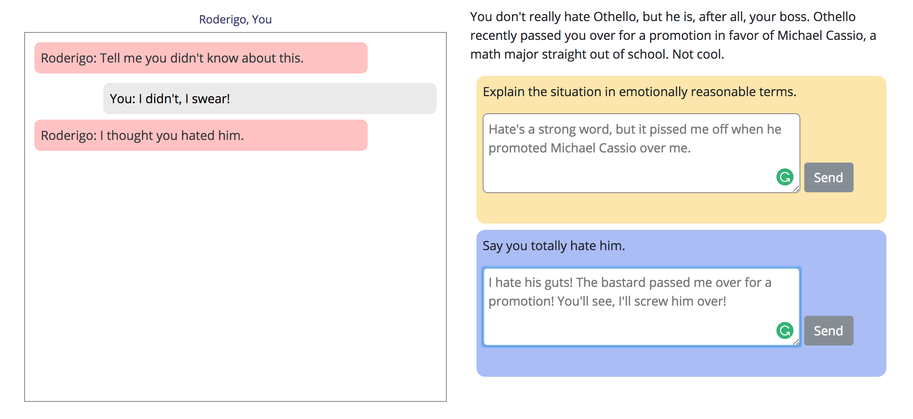

# Othello Chatbot

This is an adaptation of Shakespeare's Othello. You play Iago, the central character and villain of the play. 

## Overview
Lines of dialogue read as messages in a chatroom. You can respond to other character's messages by either telling the truth or telling a lie. Your choice affects the characters' responses and the overall story arc.

## How To Play
#### [Play Online](https://jordan-castelloe.github.io/shakespearean-chatbot/)
Or play locally:
- `` git clone ``
- `` cd lib ``
- `` npm install ``
- `` grunt ``
 

## A General Disclaimer About Othello
I'm not a Shakespeare scholar. This would probably piss a respectable Shakespeare scholar off, so let's don't tell them. Othello is well-suited for this format because the central character, Iago, is a sociopath who ruins people's lives by withholding information and lying. He treats it like a game, which makes it great game material. That said, I'm making light of a very heavy and difficult play, and everyone should go read the original and form their own opinions of it. 
